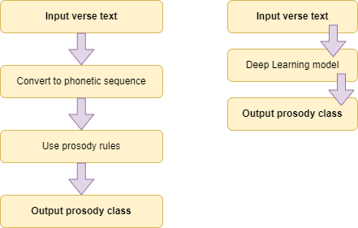
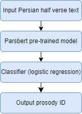
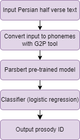
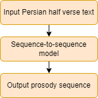
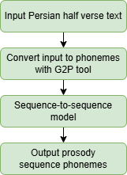
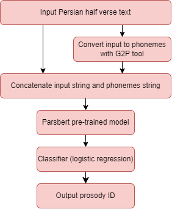
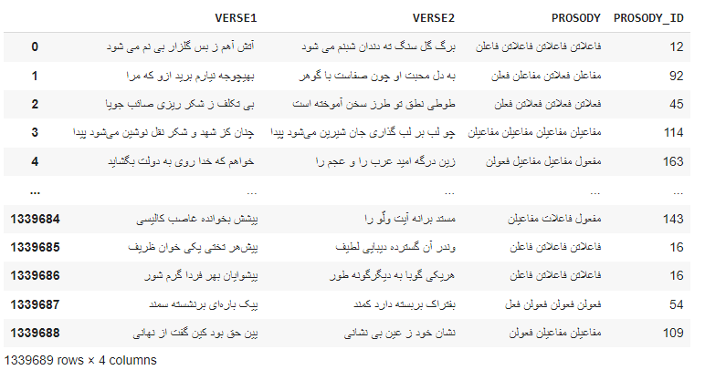

# Prosody Recognition in Persian Poetry 
<!--- This is a repository of the paper titled 
"Prosody Recognition in Persian Poetry" - [link]().-->  

## Abstract 
<p>
Classical Persian poetry, like traditional poetry from other cultures, follows set metrical patterns, known as prosody.
Recognizing prosody of a given poetry is very useful in understanding and analyzing Persian language and literature.
With the advances in artificial intelligence (AI) techniques, they became popular to recognize prosody.
However, the application of advanced AI methodologies to the task of detecting prosody in Persian poetry is not well-explored. Additionally, The lack of an extensive collection of traditional Persian poems, each meticulously annotated with its prosodic pattern, is another challenge. In this paper, first we create a large dataset of prosodic meters including about 1.3 million couplets, which contains detailed prosodic annotations. 
Then, we introduce five models that harness advanced deep learning methodologies to discern the prosody of Persian poetry. These models include: i) a transformer-based classifier, ii) a grapheme-to-phoneme mapping-based method, iii) a sequence-to-sequence model, iv) a sequence-to-sequence model with phonetic sequences, and v) a hybrid approach that leverages the strengths of both the textual information of poetry and its phonemic sequence. Our experimental results reveal that the hybrid model typically outperforms the other models, especially when applied to large samples of the created dataset.
</p>

<p align="center">
  Traditional Apporach VS Our Apporach
</p>
<p align="center">
  
</p>


## Highlights 
• We study automatic prosody detection of Persian poetry.  
• We create a large dataset of prosodic meters including about 1.3 million couplets.  
• We present five models that are based on advanced deep learning techniques.  
• We conduct extensive experiments to evaluate the performance of different models.  

## Models Architectures
The high-level structures of models:

### Transformer-based method
<p align="center">
  
</p>

### Grapheme-to-phoneme-mapping-based method
<p align="center">
  
</p>

### Sequence-to-sequence method
<p align="center">
  
</p>

### Sequence-to-sequence model with phonetic sequences
<p align="center">
  
</p>

### Hybrid method
<p align="center">
  
</p>

## Model Training 

Check the notebooks for retraining the models in [`notebooks/`](https://github.com/m-shahrestani/Prosody-Recognition-in-Persian-Poetry/notebooks).  
You can see the list of code files for the methods below.   
- [x] Transformer-based method: [`notebooks/parsbertmodel.ipynb`](https://github.com/m-shahrestani/Prosody-Recognition-in-Persian-Poetry/notebooks/parsbertmodel.ipynb)  
- [x] Grapheme-to-phoneme-mapping-based method: [`notebooks/g2p_parsbertmodel.ipynb`](https://github.com/m-shahrestani/Prosody-Recognition-in-Persian-Poetry/notebooks/g2p_parsbertmodel.ipynb)  
- [x] Sequence-to-sequence method: [`notebooks/seq2seqmodel.ipynb`](https://github.com/m-shahrestani/Prosody-Recognition-in-Persian-Poetry/notebooks/seq2seqmodel.ipynb)  
- [x] Sequence-to-sequence model with phonetic sequences: [`notebooks/g2p_seq2seqmodel.ipynb`](https://github.com/m-shahrestani/https://github.com/m-shahrestani/Prosody-Recognition-in-Persian-Poetry/notebooks/g2p_seq2seqmodel.ipynb)  
- [x] Hybrid method: [`notebooks/concat_g2p_parsbertmodel.ipynb`](https://github.com/m-shahrestani/Prosody-Recognition-in-Persian-Poetry/notebooks/concat_g2p_parsbertmodel.ipynb)  

## Results
We acheive the following results: 
| Sampling Type | parsbert | g2p_parsbert | seq2seq | g2p_seq2seq | concat_g2p_parsbert |
|---------------|----------|--------------|---------|-------------|----------------------|
| I             | **0.05718** | 0.03540     | 0.03351 | 0.02812    | 0.04723              |
| II            | 0.20011  | 0.11165      | 0.18382 | 0.16747    | **0.20245**          |
| III           | **0.34008** | 0.20348     | 0.30436 | 0.24820    | 0.30632              |
| IV            | 0.82611  | 0.67584      | 0.62216 | 0.45957    | **0.86941**          |
| V             | 0.90260  | 0.81697      | 0.75103 | 0.57310    | **0.91559**          |
| VI            | 0.95616  | 0.92645      | 0.91671 | 0.68703    | **0.95887**          |
| VII           | 0.96997  | 0.95244      | 0.94286 | 0.67672    | **0.97171**          |

*Table: F1-score results of the models for all the sampling strategies.*

## Examples 
<table border="1" class="dataframe">
<thead>
<tr style="text-align: right;">
<th></th>
<th>Verse</th>
<th>Predicted Prosody</th>
<th>Correct Prosody</th>
</tr>
</thead>
<tbody>
<tr>
<th>0</th>
<td>بتا از سوختن تا خوی گرفتن</td>
<td>مفاعیلن مفاعیلن فعولن</td>
<td>مفاعیلن مفاعیلن فعولن</td>
</tr>
<tr>
<th>1</th>
<td>صبر کردم بر جفای او غلط کردم غلط</td>
<td>فاعلاتن فاعلاتن فاعلاتن فاعلن</td>
<td>فاعلاتن فاعلاتن فاعلاتن فاعلن</td>
</tr>
<tr>
<th>2</th>
<td>آن کس که برای فقر بربست کمر</td>
<td>مفعول مفاعیل مفاعیل فعل</td>
<td>مفعول مفاعیل مفاعیل فعل</td>
</tr>
<tr>
<th>3</th>
<td>بوحنیفه گفت در شعری برای عنصری</td>
<td>فاعلاتن فاعلاتن فاعلاتن فاعلن</td>
<td>فاعلاتن فاعلاتن فاعلاتن فاعلن</td>
</tr>
<tr>
<th>4</th>
<td>که ای تو از آفاق را زندگی</td>
<td>فعولن فعولن فعولن فعل</td>
<td>فعولن فعولن فعولن فعل</td>
</tr>
<tr>
<th>5</th>
<td>پس از رفتنم مهربانی کند</td>
<td>فعولن فعولن فعولن فعل</td>
<td>فعولن فعولن فعولن فعل</td>
</tr>
<tr>
<th>6</th>
<td>ساحری استاد شد باد سحر زان در چمن</td>
<td>فاعلاتن فاعلاتن فاعلاتن فاعلن</td>
<td>فاعلاتن فاعلاتن فاعلاتن فاعلن</td>
</tr>
<tr>
<th>7</th>
<td>وی ز تیره غمزهٔ تو روح را</td>
<td>فاعلاتن فاعلاتن فاعلن</td>
<td>فاعلاتن فاعلاتن فاعلن</td>
</tr>
<tr>
<th>8</th>
<td>وز جمادی در نباتی اوفتاد</td>
<td>فاعلاتن فاعلاتن فاعلن</td>
<td>فاعلاتن فاعلاتن فاعلن</td>
</tr>
<tr>
<th>9</th>
<td>از اینگونه پنداشت آزرم دار</td>
<td>فعولن فعولن فعولن فعل</td>
<td>فعولن فعولن فعولن فعل</td>
</tr>
<tr>
<th>10</th>
<td>مرا دمیست که نسبت به سوز بی&zwnj;حد او</td>
<td>مفاعلن فعلاتن مفاعلن فعلن</td>
<td>مفاعلن فعلاتن مفاعلن فعلن</td>
</tr>
<tr>
<th>11</th>
<td>بکشت از دلیران ایران گروه</td>
<td>فعولن فعولن فعولن فعل</td>
<td>فعولن فعولن فعولن فعل</td>
</tr>
<tr>
<th>12</th>
<td>خسرو دنیا ملک شاه محمد کز ملوک</td>
<td>فاعلاتن فاعلاتن فاعلاتن فاعلن</td>
<td>فاعلاتن فاعلاتن فاعلاتن فاعلن</td>
</tr>
<tr>
<th>13</th>
<td>گرچه خاک و آب سبز و تازه نیست</td>
<td>فاعلاتن فاعلاتن فاعلن</td>
<td>فاعلاتن فاعلاتن فاعلن</td>
</tr>
<tr>
<th>14</th>
<td>صفات جد تو جبار گفت با موسی</td>
<td>مفاعلن فعلاتن مفاعلن فعلن</td>
<td>مفاعلن فعلاتن مفاعلن فعلن</td>
</tr>
<tr>
<th>15</th>
<td>دلیری نمودن بدین انجمن</td>
<td>فعولن فعولن فعولن فعل</td>
<td>فعولن فعولن فعولن فعل</td>
</tr>
<tr>
<th>16</th>
<td>همین نه لاله به داغ تو ای سمنبر سوخت</td>
<td>مفاعلن فعلاتن مفاعلن فعلن</td>
<td>مفاعلن فعلاتن مفاعلن فعلن</td>
</tr>
<tr>
<th>17</th>
<td>چون اشک من بیا و ره کاروان بگیر</td>
<td>مفعول فاعلات مفاعیل فاعلن</td>
<td>مفعول فاعلات مفاعیل فاعلن</td>
</tr>
<tr>
<th>18</th>
<td>سگ خفت و خروس نعره برداشت</td>
<td>مفاعیلن مفاعیلن فعولن</td>
<td>مفعول مفاعلن فعولن</td>
</tr>
<tr>
<th>19</th>
<td>اطفال ستمکشت رمیدند</td>
<td>مفعول مفاعلن فعولن</td>
<td>مفعول مفاعلن فعولن</td>
</tr>
</tbody>
</table>

## Dataset 

The P3R (Persian Poetry Prosody Recognition) dataset is in the file [`dataset/P3R.csv`](https://github.com/m-shahrestani/Prosody-Recognition-in-Persian-Poetry/blob/main/dataset/P3R.csv).  

<p align="center">
  
</p>

## License 

MIT and CC BY 4.0  

<!--- 
## Reference 
```

```
--> 