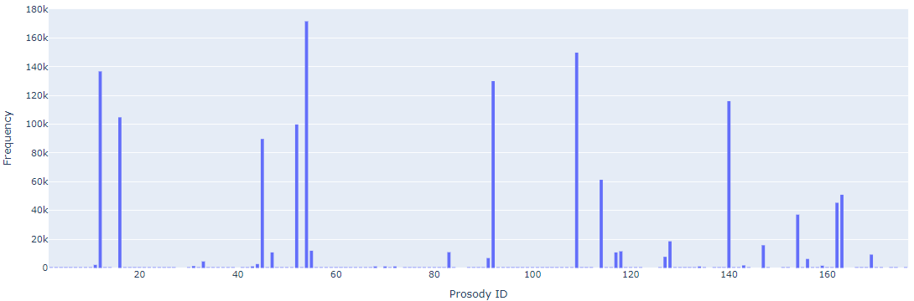

# P3R (Persian Poetry Prosody Recognition) dataset

## Abstract 
The lack of a comprehensive, annotated and publicly available dataset designed for Persian poem prosody and the shortcomings of existing datasets in supporting Persian poem meter analysis, have driven us to create a new dataset.
There are numerous collections of Persian poem, but they lack prosody labels, which poses the challenge of annotating the meters.
Requesting assistance from experts to annotate the meter in a large poem collection requires specialized individuals and entails significant time and financial costs.  
Another approach is extracting poem data and their prosodys from poetry websites, which has been employed in this research.  

Our dataset, extracted from the [Ganjoor](https://ganjoor.net/) website , includes roughly 1.3 million verses from classic Persian poetry, each paired with its prosody and corresponding prosody identifiers, covering about 150 distinct meters.
These meters have been identified by experts.  

## Illustration of P3R   
<p align="center">
  
</p>

## Distribution  
Distribution of the number of poems with the same prosody in the P3R
<p align="center">
  
</p>

## Files descriptions  
[`dataset/P3R.csv`](https://github.com/m-shahrestani/Prosody-Recognition-in-Persian-Poetry/blob/master/dataset/P3R.csv) is the P3R dataset.  
[`dataset/prosodies.csv`](https://github.com/m-shahrestani/Prosody-Recognition-in-Persian-Poetry/blob/master/dataset/prosodies.csv) is the mapping Prosody to Prosody ID.  
[`dataset/prosodies.txt`](https://github.com/m-shahrestani/Prosody-Recognition-in-Persian-Poetry/blob/master/dataset/prosodies.txt) is the identifiers for each meter.  

## Usage  
Copy the following code into a Jupyter notebook.  
```
import pandas as pd
url = "https://media.githubusercontent.com/media/m-shahrestani/Prosody-Recognition-in-Persian-Poetry/master/dataset/P3R.csv"
df = pd.read_csv(url)
df
```

## License  

CC BY 4.0  

<!--- 
## Reference 
```

```
--> 
