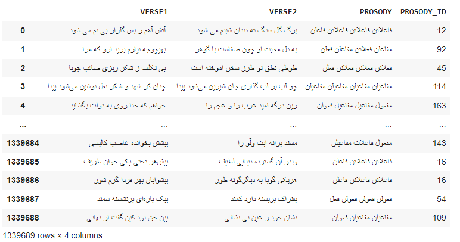

# P3R (Persian Poetry Prosody Recognition) dataset

## Abstract 
The lack of a comprehensive, annotated and publicly available dataset designed for Persian poem prosody and the shortcomings of existing datasets in supporting Persian poem meter analysis, have driven us to create a new dataset.
There are numerous collections of Persian poem, but they lack prosody labels, which poses the challenge of annotating the meters.
Requesting assistance from experts to annotate the meter in a large poem collection requires specialized individuals and entails significant time and financial costs.  
Another approach is extracting poem data and their prosodys from poetry websites, which has been employed in this research.  

Our dataset, extracted from the [Ganjoor](https://ganjoor.net/) website , includes roughly 1.3 million verses from classic Persian poetry, each paired with its prosody and corresponding prosody identifiers, covering about 150 distinct meters.
These meters have been identified by experts.  

## Illustration of P3R   
<p align="center">
  
</p>

## Distribution  
Distribution of the number of poems with the same prosody in the P3R
<p align="center">
  
</p>

## Files descriptions  
[`dataset/P3R.csv`](https://github.com/m-shahrestani/Prosody-Recognition-in-Persian-Poetry/blob/master/dataset/P3R.csv) is the P3R dataset.  
[`dataset/prosodies.csv`](https://github.com/m-shahrestani/Prosody-Recognition-in-Persian-Poetry/blob/master/dataset/prosodies.csv) is the mapping Prosody to Prosody ID.  
[`dataset/prosodies.txt`](https://github.com/m-shahrestani/Prosody-Recognition-in-Persian-Poetry/blob/master/dataset/prosodies.txt) is the identifiers for each meter.  

## Usage  
Copy the following code into a Jupyter notebook.  
```
import pandas as pd
url = "https://media.githubusercontent.com/media/m-shahrestani/Prosody-Recognition-in-Persian-Poetry/master/dataset/P3R.csv"
df = pd.read_csv(url)
df
```

## License  

CC BY 4.0  

## Reference 
```
@article{SHAHRESTANI2025103222,
title = {Prosody recognition in Persian poetry},
journal = {Speech Communication},
volume = {170},
pages = {103222},
year = {2025},
issn = {0167-6393},
doi = {https://doi.org/10.1016/j.specom.2025.103222},
url = {https://www.sciencedirect.com/science/article/pii/S0167639325000378},
author = {Mohammadreza Shahrestani and Mostafa {Haghir Chehreghani}},
keywords = {Persian poetry prosody detection, Deep learning, Transformers, Sequence-to-sequence models},
abstract = {Classical Persian poetry, like traditional poetry from other cultures, follows set metrical patterns, known as prosody. Recognizing prosody of a given poetry is very useful in understanding and analyzing Persian language and literature. With the advances in artificial intelligence (AI) techniques, they became popular to recognize prosody. However, the application of advanced AI methodologies to the task of detecting prosody in Persian poetry is not well-explored. Additionally, The lack of an extensive collection of traditional Persian poems, each meticulously annotated with its prosodic pattern, is another challenge. In this paper, first we create a large dataset of prosodic meters including about 1.3 million couplets, which contains detailed prosodic annotations. Then, we introduce five models that harness advanced deep learning methodologies to discern the prosody of Persian poetry. These models include: (i) a transformer-based classifier, (ii) a grapheme-to-phoneme mapping-based method, (iii) a sequence-to-sequence model, (iv) a sequence-to-sequence model with phonemic sequences, and (v) a hybrid approach that leverages the strengths of both the textual information of poetry and its phonemic sequence. Our experimental results reveal that the hybrid model typically outperforms the other models, especially when applied to large samples of the created dataset. Our code is publicly available in https://github.com/m-shahrestani/Prosody-Recognition-in-Persian-Poetry/.}
}
```
